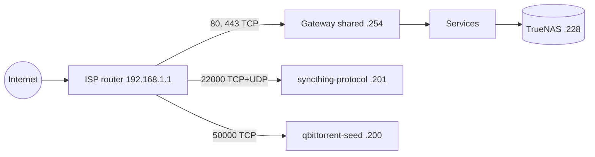

# homelab

GitOps repository for a family homelab: a four-node arm64 Kubernetes cluster
that hosts photos, media, files, documents and recipes for the household,
behind one Keycloak single sign-on. Argo CD deploys it from this repository:
one root Application, three layers, one Application per app.

## At a glance

- Hardware: 4x Turing RK1 (Rockchip RK3588, arm64, 32 GB) on a Turing Pi 2
  board. 3 control planes and 1 worker.
- OS and Kubernetes: Ubuntu, Kubernetes (kubeadm), containerd.
  API on the VIP `192.168.1.11` (kube-vip).
- GitOps: Argo CD. CNI: Cilium, which also serves the shared
  Gateway on `192.168.1.254`.
- Storage: TrueNAS CORE NAS at `192.168.1.228`. iSCSI block volumes through
  democratic-csi (StorageClasses `iscsi`, default, and `iscsi-retain`) and an
  NFS share for media. Data volumes use reclaim policy `Retain`.
- Public names: `<name>.lilalala.com`, TLS from Let's Encrypt, DNS records
  managed by external-dns in Cloudflare.

## Start here

- First install of a cluster: [docs/bootstrap.md](docs/bootstrap.md).
- Power loss or move: [docs/runbooks/cold-start.md](docs/runbooks/cold-start.md).
- A failed or reinstalled node: [docs/runbooks/node-replacement.md](docs/runbooks/node-replacement.md).
- How it fits together: [docs/architecture.md](docs/architecture.md),
  [docs/networking.md](docs/networking.md), [docs/decisions.md](docs/decisions.md).
- Data: [docs/backups.md](docs/backups.md), [docs/secrets.md](docs/secrets.md).
- Monitoring: [docs/observability.md](docs/observability.md).
- App runbooks: [docs/runbooks/](docs/runbooks).

## Services

| Service | Purpose | Namespace | Public hostname | Keycloak SSO |
| --- | --- | --- | --- | --- |
| Immich | Photos and videos | `immich` | `media` | Yes |
| Plex | Media server | `theater` | `theater` | No |
| Sonarr, Radarr, Lidarr, Prowlarr | Media management | `theater` | `theater` under `/arr/<app>` | No |
| qBittorrent | Downloads | `theater` | none (LAN only; seeding port on `.200`) | No |
| Jellyfin | Media server | `theater` | `cinema` | No |
| Seafile | File sync and share | `seafile` | `drive` | No |
| Paperless-ngx | Document archive | `paperless` | `archive` | Yes |
| Mealie | Recipes | `mealie` | `cook` | Yes |
| Syncthing | Device sync | `syncthing` | `syncthing` (UI); sync on `.201` | No |
| Keycloak | Single sign-on, realm `homelab` | `keycloak` | `auth` | - |
| Grafana, Prometheus, Alertmanager | Monitoring | `monitoring` | `grafana` | Yes (Grafana) |
| Argo CD | GitOps controller | `argo` | `argo` | Yes |

Hostnames are prefixes of `lilalala.com`. Plex and Jellyfin stay off SSO so
their TV apps can sign in.

## Platform

| Component | Role | Managed by |
| --- | --- | --- |
| Argo CD | App-of-apps: `root` -> `layer-infrastructure`, `layer-platform`, `layer-apps` -> one Application per app | Helm CLI release `argocd` (chart argo-cd) in namespace `argo`, values in [`bootstrap/argocd-values.yaml`](bootstrap/argocd-values.yaml) |
| Cilium | CNI, kube-proxy replacement, L2-announced LoadBalancer IP pools, Gateway API | Argo CD (release name `cilium`), values in [`infrastructure/cilium/values.yaml`](infrastructure/cilium/values.yaml); installed by hand once on a fresh cluster |
| kube-vip | Kubernetes API VIP `192.168.1.11` | Static pods on the control planes, written by hand ([manifest](docs/runbooks/node-replacement.md#kube-vip-manifest)) |
| Cilium Gateway | Shared Gateway `gateway/shared` for every public hostname, on `192.168.1.254` | Argo CD |
| cert-manager | Certificates, ClusterIssuer `letsencrypt`, DNS-01 via Cloudflare | Argo CD |
| external-dns | Cloudflare records for every Ingress and HTTPRoute, upsert only | Argo CD |
| CloudNativePG | PostgreSQL for Immich, Keycloak, Mealie, Sonarr, Radarr, Lidarr and Prowlarr | Argo CD |
| democratic-csi | iSCSI volumes on TrueNAS | Argo CD (release name `iscsi`), values in [`infrastructure/democratic-csi/values-iscsi.yaml`](infrastructure/democratic-csi/values-iscsi.yaml); driver config sealed in [`infrastructure/secrets/`](infrastructure/secrets) |
| kube-prometheus-stack | Prometheus, Alertmanager, Grafana | Argo CD |

The public WAN IP is set in one place only: `--default-targets` in
[`infrastructure/external-dns/values.yaml`](infrastructure/external-dns/values.yaml).
Ingresses carry no target annotation.

Chart versions live next to each Application in
[`clusters/homelab/`](clusters/homelab), and in [`ci/helm-releases.yaml`](ci/helm-releases.yaml) for the releases
installed with the Helm CLI.

## Networking



| Address | Use |
| --- | --- |
| `192.168.1.0/24` | Home LAN |
| `192.168.1.1` | ISP router: gateway, DHCP, DNS forwarder |
| `192.168.1.50`-`.199` | DHCP pool |
| `192.168.1.11` | Kubernetes API VIP (kube-vip), port 6443 |
| `192.168.1.247` | `homelab-cp-1` |
| `192.168.1.238` | `homelab-cp-2` |
| `192.168.1.239` | `homelab-cp-3` |
| `192.168.1.240` | `homelab-w-1` (worker) |
| `192.168.1.228` | TrueNAS CORE (iSCSI, NFS) |
| `192.168.1.200`-`.227` | Cilium pool `pool-2` (LoadBalancer Services) |
| `192.168.1.200` | `theater/qbittorrent-seed`, pinned |
| `192.168.1.201` | `syncthing/syncthing-protocol`, pinned |
| `192.168.1.254` | Cilium pool `pool-1`: `gateway/cilium-gateway-shared`, pinned |

Nodes use static addresses outside the DHCP pool. Pinned LoadBalancer IPs use
the `lbipam.cilium.io/ips` annotation so the router port forwards stay valid.

## Repository layout

| Path | Contents |
| --- | --- |
| [`clusters/homelab/`](clusters/homelab) | Argo CD objects only: `root.yaml` -> three layers (`infrastructure`, `platform`, `apps`) -> one Application per app |
| [`infrastructure/`](infrastructure) | Namespaces, Cilium pools, cert-manager, external-dns, the shared Gateway, democratic-csi |
| [`platform/`](platform) | CloudNativePG, kube-prometheus-stack, Keycloak |
| [`apps/`](apps) | Immich, Mealie, Paperless, Seafile, Syncthing, the theater stack |
| `*/secrets/` | SOPS-encrypted Secrets (age), decrypted by KSOPS in Argo CD |
| [`deploy/`](deploy) | Rendered manifests Argo CD reads (`scripts/render-deploy.sh`; CI fails if stale) |
| [`bootstrap/`](bootstrap) | `root-app.yaml` (the root Application, applied once by hand), values for the `argocd` Helm release, OpenTofu for a fresh install |
| [`ansible/`](ansible) | Node OS and kubeadm upgrade playbooks |
| [`ci/`](ci) | Helm CLI release list, vendored CRD schemas, pinned CI Python requirements |
| [`scripts/`](scripts) | CI entry points (`scripts/ci/`), read-only cluster smoke suite (`smoke.sh`), guarded merge (`pr-merge.sh`), Trivy gate |
| [`tests/`](tests) | pytest and bash tests for the scripts |
| [`docs/`](docs) | Architecture, networking, bootstrap, backups, secrets, observability, decisions, runbooks, [roadmap](docs/roadmap.md) |
| [`.github/workflows/ci.yaml`](.github/workflows/ci.yaml) | CI |

Every Application tracks `main` and syncs automatically with self-heal, except
`immich`. Immich is synced by hand, because an Immich upgrade runs database
migrations that cannot be undone. App leaves prune. The root, the layers,
`namespaces`, `cilium`, `democratic-csi` and the leaves that ship CRDs do not. Every PVC, CNPG Cluster, StatefulSet and Namespace
carries `argocd.argoproj.io/sync-options: Delete=false,Prune=false`, and no
Application has a cascading finalizer. The photo library PVC `immich/immich-data`
is in no Application at all.

## CI

Every pull request and every push to `main` runs
[`.github/workflows/ci.yaml`](.github/workflows/ci.yaml): four parallel jobs,
one step per check. Inside a job every check runs even when an earlier one
fails, and the job fails if any check failed.

- `lint`: `yamllint`, `actionlint`, `shellcheck`, `tofu fmt` and
  `tofu validate`.
- `render`: unit tests (pytest and bash), a render of every Application and
  Helm release, `kubeconform` (strict schema validation against the cluster's
  Kubernetes version and the vendored CRD schemas) and `repo-policy` (pinned actions,
  repository invariants, secrets, leak and placeholder checks, `deploy/`
  matches its sources, kube-linter).
- `security`: `gitleaks` on the new commits, and the Trivy config scan.
  CRITICAL fails; HIGH fails only when it increases against the merge base.
  Waivers in [`.trivyignore.yaml`](.trivyignore.yaml) are scoped and expire.
- `pr-metadata` (pull requests only): Conventional Commits, titles under 70
  characters, every commit signed and verified.

A last job, `ci`, needs all four and fails unless each one passed
(`pr-metadata` may be skipped on a push). `ci` is the only required check,
for branch protection and for `scripts/pr-merge.sh`.

Every action is pinned to a commit SHA and every tool to a version and checksum.

## How changes reach the cluster

1. Branch from `main`, commit signed Conventional Commits.
2. Open a pull request. CI must be green.
3. Squash-merge with `scripts/pr-merge.sh <pr-number>`. It refuses unless
   every required check is green, the title and commits pass, every commit is
   verified, the branch is up to date with `main` and no merge freeze is set.
4. That is the deployment. Every Application tracks `main`, so Argo CD
   applies the merge within its sync interval (3 minutes). Rollback is a
   revert pull request.
5. Two things are not automatic. `immich` is synced by hand
   (`argocd app sync immich`, see
   [docs/runbooks/immich-upgrade.md](docs/runbooks/immich-upgrade.md)). The Helm
   CLI release `argocd` is upgraded by hand from a merged commit, as
   described at the top of its values file.

Check what is deployed:

```sh
kubectl -n argo get applications \
  -o custom-columns=NAME:.metadata.name,SYNC:.status.sync.status,HEALTH:.status.health.status,REVISION:.status.sync.revision
```

Expected output: every Application is `Synced` and `Healthy`.
Single-source Applications show the SHA of the latest commit on `main`.
Multi-source ones (the Helm charts) leave `REVISION` empty.

## Status and roadmap

- Ingress: the shared Cilium Gateway serves every public hostname on
  `192.168.1.254`; there is no ingress controller.
- Backups: nightly restic jobs copy files and most databases to S3 (and the
  photo library to the NAS). `immich-db`, `keycloak-db` and etcd rely on
  on-demand local dumps and snapshots until the Barman Cloud plugin runs,
  which needs a CloudNativePG upgrade.
  Data PVs are on reclaim policy `Retain`
  ([details](docs/backups.md#reclaim-policy)).
- Alerting: Prometheus and Grafana run; Alertmanager delivers to nobody yet
  ([docs/observability.md](docs/observability.md)).
- Everything else that is deliberately deferred: [docs/roadmap.md](docs/roadmap.md).
