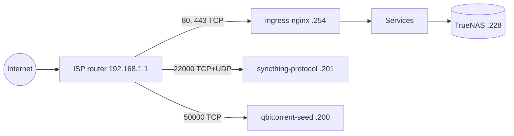

# homelab

GitOps repository for a family homelab: a four-node arm64 Kubernetes cluster
that hosts photos, media, files, documents and recipes for the household,
behind one Keycloak single sign-on. Argo CD deploys everything under
[`kubernetes/applications/`](kubernetes/applications) from this repository.

## At a glance

- Hardware: 4x Turing RK1 (Rockchip RK3588, arm64, 32 GB) on a Turing Pi 2
  board. 3 control planes and 1 worker.
- OS and Kubernetes: Ubuntu 22.04, kubeadm, Kubernetes v1.32.13, containerd.
- Storage: TrueNAS CORE NAS at `192.168.1.228`. iSCSI block volumes through
  democratic-csi (StorageClass `iscsi`, default) and an NFS share for media.
- Public names: `<name>.lilalala.com`, TLS from Let's Encrypt, DNS records
  managed by external-dns in Cloudflare.

## Services

| Service | Purpose | Namespace | Public hostname | Keycloak SSO |
| --- | --- | --- | --- | --- |
| Immich | Photos and videos | `immich` | `media` | Yes |
| Plex | Media server | `theater` | `theater` | No |
| Sonarr, Radarr, Lidarr, Prowlarr | Media management | `theater` | `theater` under `/arr/<app>` | No |
| qBittorrent | Downloads | `theater` | none (LAN only; seeding port on `.200`) | No |
| Jellyfin | Media server | `theater` | `cinema` | No |
| Seafile | File sync and share | `seafile` | `drive` | No |
| Paperless-ngx | Document archive | `paperless` | `archive` | Yes |
| Mealie | Recipes | `mealie` | `cook` | Yes |
| Syncthing | Device sync | `syncthing` | `syncthing` (UI); sync on `.201` | No |
| Keycloak | Single sign-on, realm `homelab` | `keycloak` | `auth` | - |
| Grafana, Prometheus, Alertmanager | Monitoring | `monitoring` | `grafana` | Yes (Grafana) |
| Argo CD | GitOps controller | `argo` | `argo` | Yes |

Hostnames are prefixes of `lilalala.com`. Plex and Jellyfin stay off SSO so
their TV apps can sign in.

## Platform

| Component | Role | Managed by |
| --- | --- | --- |
| Argo CD | App-of-apps: root Application `all-apps` syncs `kubernetes/applications` | Helm release `argocd`, values in [`bootstrap/argocd-values.yaml`](bootstrap/argocd-values.yaml) |
| Cilium | CNI, kube-proxy replacement, L2-announced LoadBalancer IP pools | Helm release `cilium`, values in [`infrastructure/cilium/values.yaml`](infrastructure/cilium/values.yaml) |
| kube-vip | Kubernetes API VIP `192.168.1.11` | Static pods on the control planes |
| ingress-nginx | Ingress for every public hostname, on `192.168.1.254` | Argo CD |
| cert-manager | Certificates, ClusterIssuer `letsencrypt`, DNS-01 via Cloudflare | Argo CD |
| external-dns | Cloudflare records for every Ingress, upsert only | Argo CD |
| CloudNativePG | PostgreSQL for Immich, Keycloak, Mealie, Sonarr, Radarr, Lidarr and Prowlarr | Argo CD |
| democratic-csi | iSCSI volumes on TrueNAS | Helm release `iscsi`, values in [`infrastructure/democratic-csi/values-iscsi.yaml`](infrastructure/democratic-csi/values-iscsi.yaml) plus the SOPS-sealed driver config |
| kube-prometheus-stack | Prometheus, Alertmanager, Grafana | Argo CD |

The public WAN IP is set in one place only: `--default-targets` in
[`infrastructure/external-dns/values.yaml`](infrastructure/external-dns/values.yaml).
Ingresses carry no target annotation.

Chart versions live next to each Application in `kubernetes/applications/`,
and in [`ci/helm-releases.yaml`](ci/helm-releases.yaml) for the releases
installed with the Helm CLI.

## Networking



| Address | Use |
| --- | --- |
| `192.168.1.0/24` | Home LAN |
| `192.168.1.1` | ISP router: gateway, DHCP, DNS forwarder |
| `192.168.1.50`-`.199` | DHCP pool |
| `192.168.1.11` | Kubernetes API VIP (kube-vip), port 6443 |
| `192.168.1.247` | `homelab-cp-1` |
| `192.168.1.238` | `homelab-cp-2` |
| `192.168.1.239` | `homelab-cp-3` |
| `192.168.1.240` | `homelab-w-1` (worker) |
| `192.168.1.228` | TrueNAS CORE (iSCSI, NFS) |
| `192.168.1.200`-`.227` | Cilium pool `pool-2` (LoadBalancer Services) |
| `192.168.1.200` | `theater/qbittorrent-seed`, pinned |
| `192.168.1.201` | `syncthing/syncthing-protocol`, pinned |
| `192.168.1.202` | `gateway/cilium-gateway-shared`, pinned (Gateway parallel run, once the layered tree is adopted) |
| `192.168.1.254` | Cilium pool `pool-1`: `ingress/ingress-nginx-controller` |

Nodes use static addresses outside the DHCP pool. Pinned LoadBalancer IPs use
the `lbipam.cilium.io/ips` annotation so the router port forwards stay valid.

## Repository layout

| Path | Contents |
| --- | --- |
| [`kubernetes/applications/`](kubernetes/applications) | What Argo CD syncs: child Applications for Helm charts and plain manifests, one directory per app |
| [`bootstrap/argocd-values.yaml`](bootstrap/argocd-values.yaml) | Values for the `argocd` Helm release |
| [`infrastructure/cilium/values.yaml`](infrastructure/cilium/values.yaml) | Values for the `cilium` Helm release |
| [`ci/`](ci) | Helm CLI release list, vendored CRD schemas, pinned CI Python requirements |
| [`iac/`](iac) | Initial install: OpenTofu for Argo CD, an Ansible apt upgrade playbook, democratic-csi values. The live root Application differs from `iac/opentofu` (SHA pin, no prune) |
| [`scripts/`](scripts) | CI entry points (`scripts/ci/`), read-only cluster smoke suite (`smoke.sh`), guarded merge (`pr-merge.sh`), Trivy gate |
| [`tests/`](tests) | pytest and bash tests for the scripts |
| [`.github/workflows/ci.yaml`](.github/workflows/ci.yaml) | CI |

### The layered tree (in git, not applied yet)

The tree that replaces `kubernetes/applications/`. It renders to what runs today
(same names, namespaces, claims, images and chart versions), and nothing in it is
applied until the cutover ([runbook](docs/runbooks/adopt-layered-tree.md)), which
moves one app at a time so the two roots never own the same object.

| Path | Contents |
| --- | --- |
| [`clusters/homelab/`](clusters/homelab) | Argo CD objects only: `root.yaml` -> three layers (`infrastructure`, `platform`, `apps`) -> one Application per app |
| [`infrastructure/`](infrastructure) | Namespaces, Cilium pools, cert-manager, external-dns, ingress-nginx and its Ingresses, the shared Gateway, democratic-csi |
| [`platform/`](platform) | CloudNativePG, kube-prometheus-stack, Keycloak |
| [`apps/`](apps) | Immich, Mealie, Paperless, Seafile, Syncthing, the theater stack |
| `*/secrets/` | SOPS-encrypted Secrets (age), decrypted by KSOPS in Argo CD |
| [`deploy/`](deploy) | Rendered manifests Argo CD reads (`scripts/render-deploy.sh`; CI fails if stale) |
| [`docs/`](docs) | Architecture, networking, backups, secrets, ADRs, runbooks, [roadmap](docs/roadmap.md) |

Every Application tracks `main`. App leaves prune; the root, the layers and
CRD-bearing leaves do not. Every PVC, CNPG Cluster, StatefulSet and Namespace
carries `argocd.argoproj.io/sync-options: Delete=false,Prune=false`, and no
Application has a cascading finalizer.

## CI

Every pull request and every push to `main` runs
[`.github/workflows/ci.yaml`](.github/workflows/ci.yaml). The aggregate check
`ci` passes only when every job passes:

- `yamllint`, `actionlint`, `shellcheck`.
- `render`: unit tests, then renders every Application and Helm release.
- `kubeconform`: strict schema validation of the render against Kubernetes
  1.32.13 and the vendored CRD schemas.
- `repo-policy`: pinned actions and repository invariants.
- `gitleaks`: secret scan of the new commits.
- `trivy`: config scan. CRITICAL fails; HIGH fails only when it increases
  against the merge base. Waivers in [`.trivyignore.yaml`](.trivyignore.yaml)
  are scoped and expire.
- `tofu`: `fmt` and `validate`.
- `pr-title`, `commits`: Conventional Commits, titles under 70 characters,
  every commit signed and verified.

Every action is pinned to a commit SHA and every tool to a version and checksum.

## How changes reach the cluster

1. Branch from `main`, commit signed Conventional Commits.
2. Open a pull request. CI must be green.
3. Squash-merge with `scripts/pr-merge.sh <pr-number>`. It refuses unless
   every required check is green, the title and commits pass, every commit is
   verified, the branch is up to date with `main` and no merge freeze is set.
4. That is the deployment. The root Application `all-apps`
   ([`bootstrap/root-app.yaml`](bootstrap/root-app.yaml)) tracks `main`, so
   Argo CD applies the merge within its sync interval. Sync is automated with
   self-heal and without prune. Rollback is a revert pull request.
5. The Helm CLI releases (`argocd`, `cilium`, `iscsi`) are upgraded by hand
   from a merged commit, as described at the top of each values file.

Check what is deployed:

```sh
kubectl -n argo get application all-apps \
  -o jsonpath='{.spec.source.targetRevision} {.status.sync.revision}{"\n"}'
```

Expected output: `main` followed by the SHA of the latest commit on `main`.

## Status and roadmap

- Restructure: the layered tree is in git at parity with the cluster and
  waits for the app-by-app cutover. It replaces `kubernetes/applications/` and
  the inline credentials that tree still carries.
- Gateway API: the shared Cilium Gateway is written for a parallel run on
  `192.168.1.202`; after that, one change hands `192.168.1.254` over from
  ingress-nginx, so the router forwards stay as they are.
- Platform upgrades: Argo CD and Cilium to the versions in
  `ci/helm-releases.yaml`, then Kubernetes and the node OS.
- Off-site backups: not active yet. Backups today are local database dumps
  and etcd snapshots. Data PVs are on reclaim policy `Retain`
  ([details](docs/backups.md#reclaim-policy-current-state)).
- Everything else that is deliberately deferred: [docs/roadmap.md](docs/roadmap.md).
